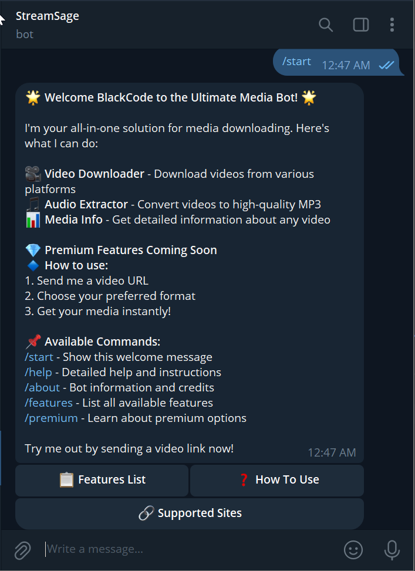

# Ultimate Media Bot - Telegram Video Downloader


A powerful Telegram bot that allows users to download videos and extract audio from various platforms directly in their chats.

## 🌟 Features

- **Multi-platform Support**: Download from YouTube, TikTok, Twitter, Instagram, and more
- **Audio Extraction**: Convert videos to high-quality MP3 files
- **Video Information**: Get detailed metadata about videos
- **User-Friendly**: Simple interface with interactive buttons
- **Fast Processing**: Quick downloads with progress updates

### Supported Platforms


## 🚀 Getting Started

### Prerequisites

- Python 3.10+
- Telegram Bot Token (from [BotFather](https://t.me/BotFather))
- FFmpeg installed on your system

### Installation

1. Clone the repository:
```bash
git https://github.com/ChrisKusi/StreamSageBot
cd StreamSageBot
```

2. Install dependencies:
```bash
pip install -r requirements.txt
```

3. Create a `.env` file with your Telegram token:
```env
TELEGRAM_BOT_TOKEN=your_bot_token_here
```

4. Run the bot:
```bash
python main.py
```

## 🛠️ Configuration

The bot can be configured through environment variables:

| Variable | Description | Default |
|----------|-------------|---------|
| `TELEGRAM_BOT_TOKEN` | Your Telegram bot token | Required |
| `MAX_VIDEO_SIZE` | Maximum file size for free users (bytes) | 50MB |
| `MAX_PREMIUM_SIZE` | Maximum file size for premium users (bytes) | 100MB |

## 🎯 Usage

### Basic Commands

- `/start` - Welcome message and bot introduction
- `/help` - Detailed help instructions
- `/about` - Bot information and credits
- `/features` - List all available features
- `/premium` - Premium subscription information

### How to Download

1. Send the bot a valid video URL
2. Choose your preferred format (video or audio)
3. Wait for processing
4. Receive your file directly in chat

## 📂 Project Structure

```
StreamSageBot/
├── main.py                # Main bot application
├── README.md             # This documentation
├── requirements.txt      # Python dependencies
├── .env.example          # Environment variables template
└── .gitignore            # Git ignore file
```

## 🔧 Technologies Used


## 🤝 Contributing

Contributions are welcome! Please follow these steps:

1. Fork the project
2. Create your feature branch (`git checkout -b feature/AmazingFeature`)
3. Commit your changes (`git commit -m 'Add some amazing feature'`)
4. Push to the branch (`git push origin feature/AmazingFeature`)
5. Open a Pull Request

## 📜 License

Distributed under the MIT License. See `LICENSE` for more information.

## 📧 Contact

Christian Kusi - [@chriskusi](https://t.me/chriskusi) - kusichris656@gmail.com


Project Link: [https://github.com/ChrisKusi/StreamSageBot](https://github.com/ChrisKusi/StreamSageBot)

## 🙏 Acknowledgments

- [python-telegram-bot](https://github.com/python-telegram-bot/python-telegram-bot) team
- [yt-dlp](https://github.com/yt-dlp/yt-dlp) developers
- All the open-source contributors

---

Built with ❤️!

 

